# Projeto Integrado de Desenvolvimento Mobile

Ecossistema de três aplicativos Android escritos em Kotlin, desenvolvidos em dupla. Cada aplicativo fica em uma pasta própria e é um projeto Gradle independente. Os três seguem a mesma identidade visual, definida no protótipo do Figma.

## Equipe

| Integrante | GitHub |
|---|---|
| Augusto Caixeta | [@augustocaixeta](https://github.com/augustocaixeta) |
| Gustavo Nunes Melo | [@gustavognm](https://github.com/gustavognm) |

## Links

- Protótipo no Figma: [Prova 02](https://www.figma.com/design/RWYQextu1DBmfUO1EpWm0A/Prova-02?node-id=28-868)

## Aplicativos

| App | Pasta | Tema | Interface | Responsável |
|---|---|---|---|---|
| 01 Ler+ | [reading-study-manager](reading-study-manager) | Gestão de leituras e estudos | Jetpack Compose | Augusto e Gustavo |
| 02 Meus Treinos | [workout-performance-tracker](workout-performance-tracker) | Registro de treinos e corridas | Views com XML | Gustavo |
| 03 Em Dia | [deadlines-bills-tracker](deadlines-bills-tracker) | Prazos, faturas e cobranças | Views com XML | Augusto |

## Estrutura do repositório

```
mobile-development-projects/
├── reading-study-manager/          App 01 Ler+
├── workout-performance-tracker/    App 02 Meus Treinos
├── deadlines-bills-tracker/        App 03 Em Dia
└── screenshots/                    Imagens usadas neste README
```

## Tecnologias em comum

- Kotlin com Coroutines e Flow
- Arquitetura MVVM com ViewModel e StateFlow
- Room para persistência local, com KSP
- Android Gradle Plugin 9.3.3 e Gradle 9.5
- minSdk 24 (Android 7.0) e targetSdk 37

## Como executar

1. Clone o repositório.

```bash
git clone https://github.com/augustocaixeta/mobile-development-projects.git
```

2. No Android Studio, abra a pasta do aplicativo desejado, por exemplo `reading-study-manager`.
3. Aguarde a sincronização do Gradle e execute em um emulador ou aparelho com Android 7.0 ou superior.

Também é possível usar a linha de comando dentro da pasta de cada app.

```bash
./gradlew assembleDebug
./gradlew test
./gradlew connectedDebugAndroidTest
```

No Windows, use `gradlew.bat` no lugar de `./gradlew`.

---

## App 01: Ler+

Aplicativo para organizar leituras e estudos pessoais. O usuário cadastra livros, acompanha o progresso de cada um, registra notas e sessões de leitura e acompanha o desempenho por semana, mês e ano.

### Arquitetura

- Interface 100% declarativa com Jetpack Compose e Material 3
- MVVM com um ViewModel por tela, expondo o estado com StateFlow
- Navigation Compose com rotas tipadas
- Room com as tabelas `books`, `notes` e `sessions`
- DataStore para a meta mensal de páginas

| Pacote | Conteúdo |
|---|---|
| `data` | Entidades, DAOs, repositórios e regras de progresso |
| `ui/home` | Catálogo, filtros e resumo do mês |
| `ui/form` | Novo registro com os segmentos Livro, Sessão e Meta |
| `ui/detail` | Detalhe do livro, situação e notas |
| `ui/session` | Sessão ativa com cronômetro |
| `ui/performance` | Gráfico, estatísticas e conquistas |
| `ui/components` | Componentes do design system |
| `ui/theme` | Cores e tipografia |

### Modelo de dados

| Tabela | Campos principais | Relação |
|---|---|---|
| `books` | título, autor, total de páginas, gênero, ícone, situação, página atual, prazo, início e término | |
| `notes` | tipo (anotação, insight ou citação), texto, página | N para 1 com `books` |
| `sessions` | início, duração, página inicial e página final | N para 1 com `books` |

Ao excluir um livro, as notas e as sessões dele são apagadas em cascata.

### Catálogo e filtros

A tela inicial mostra o resumo do mês (páginas dos livros concluídos, quantidade de livros e o percentual da meta) e o catálogo agrupado por situação. As abas filtram por situação e as pílulas filtram por gênero. Os dois filtros são aplicados em uma consulta reativa do Room, então a lista se atualiza sozinha quando um livro muda. Prazos vencidos aparecem em laranja.

<table>
  <tr>
    <td align="center">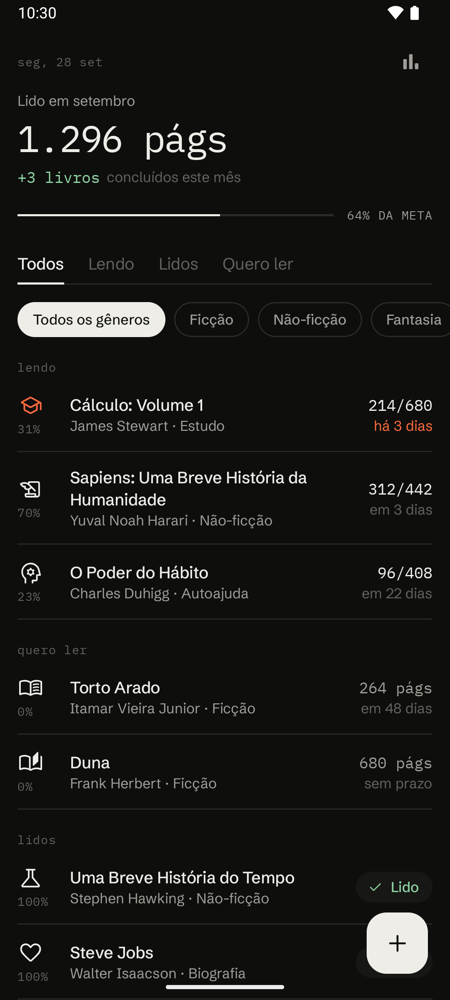<br>Início</td>
    <td align="center">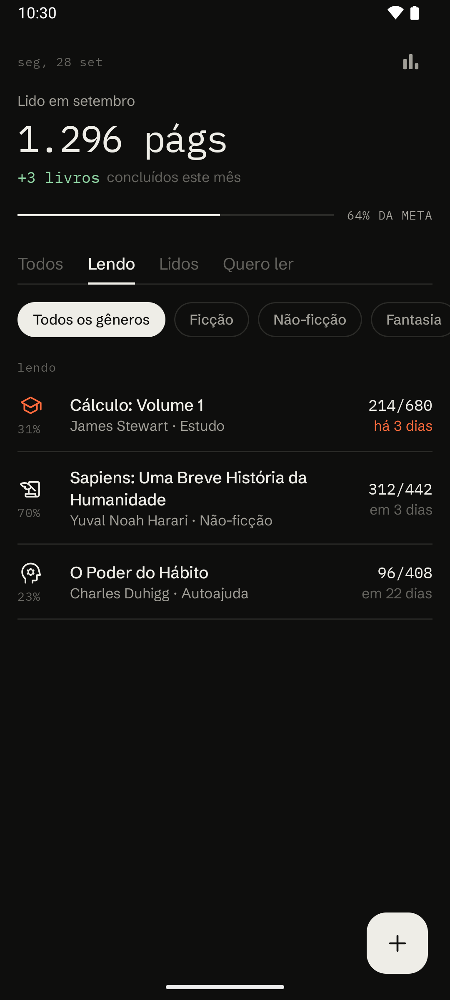<br>Filtro por situação</td>
    <td align="center">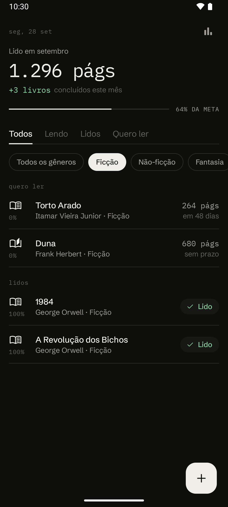<br>Filtro por gênero</td>
  </tr>
</table>

### Cadastro de livros

O segmento Livro cadastra título, autor, total de páginas, gênero, ícone de capa e um prazo opcional escolhido com os seletores de data e horário. O formulário valida os campos obrigatórios, impede livros duplicados (mesmo título e autor), recusa prazos que já passaram e, na edição, não aceita um total de páginas menor que a página atual.

<table>
  <tr>
    <td align="center">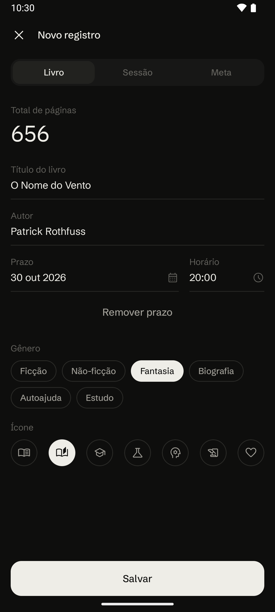<br>Livro preenchido</td>
    <td align="center">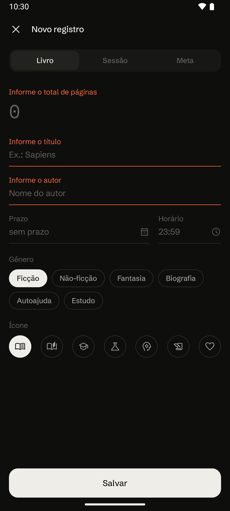<br>Validações</td>
    <td align="center">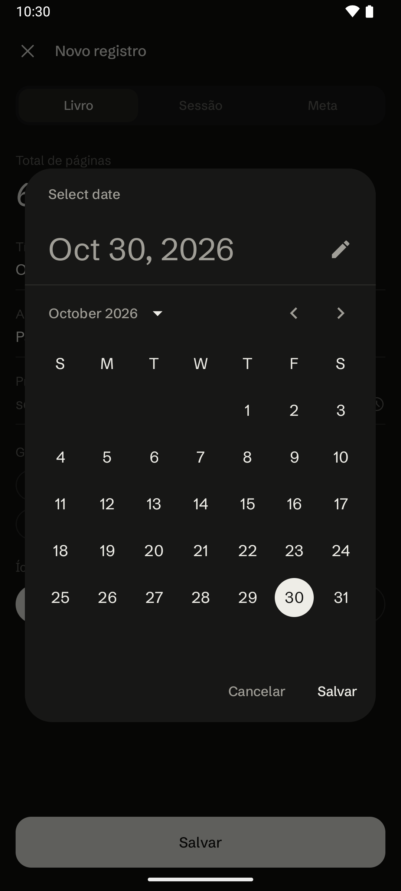<br>Data do prazo</td>
    <td align="center">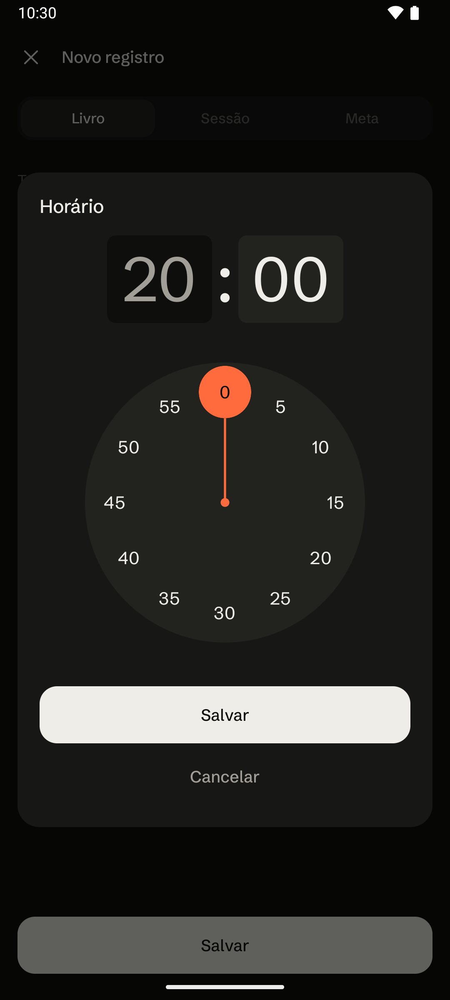<br>Horário do prazo</td>
  </tr>
</table>

### Sessões e meta mensal

O segmento Sessão registra uma leitura feita fora do app, com livro, páginas lidas, data, horário de início e duração. O segmento Meta define quantas páginas o usuário quer ler por mês. A meta aparece no resumo do Início e nas conquistas do Desempenho.

<table>
  <tr>
    <td align="center">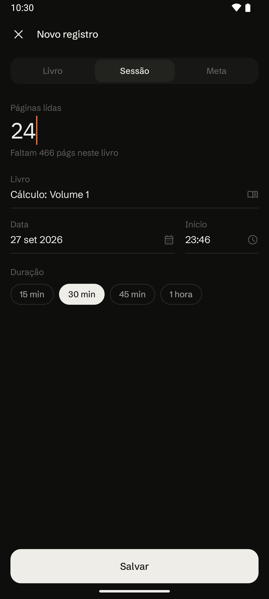<br>Nova sessão</td>
    <td align="center">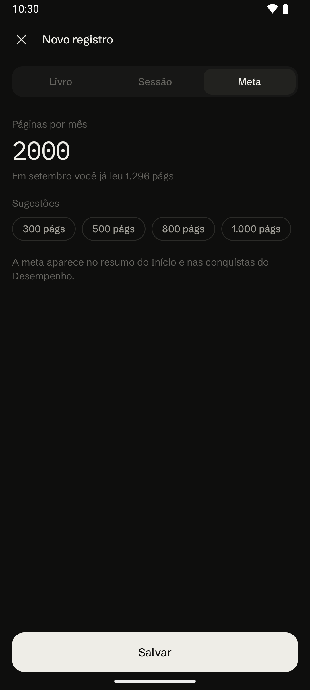<br>Meta mensal</td>
  </tr>
</table>

### Progresso de leitura

O detalhe mostra as páginas lidas, quantas faltam, o prazo e a barra de progresso percentual. As pílulas Quero ler, Lendo e Lido mudam a situação do livro. Ao começar a leitura, a data de início é preenchida, e ao marcar como lido a página atual passa a ser a última. A página atual também pode ser atualizada pelo menu da tela.

<table>
  <tr>
    <td align="center">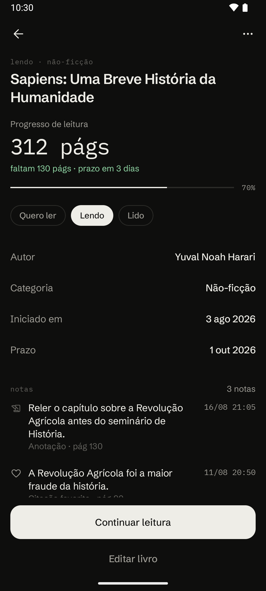<br>Livro em leitura</td>
    <td align="center">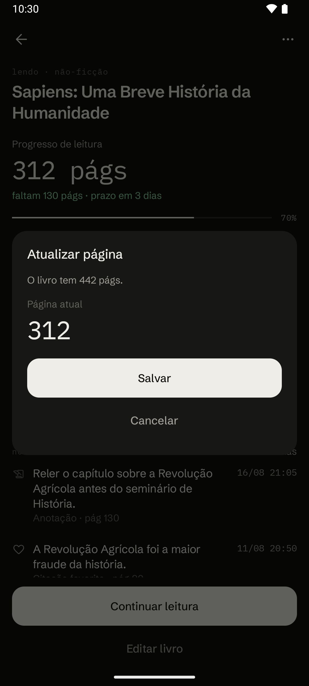<br>Atualizar página</td>
    <td align="center">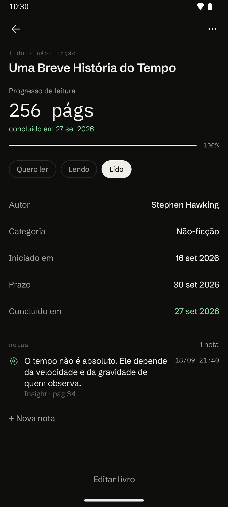<br>Livro lido</td>
  </tr>
</table>

### Diário e notas

Cada livro tem um diário com anotações, insights e citações favoritas, com a página de referência. As notas podem ser criadas, editadas e excluídas pelo detalhe do livro.

<table>
  <tr>
    <td align="center">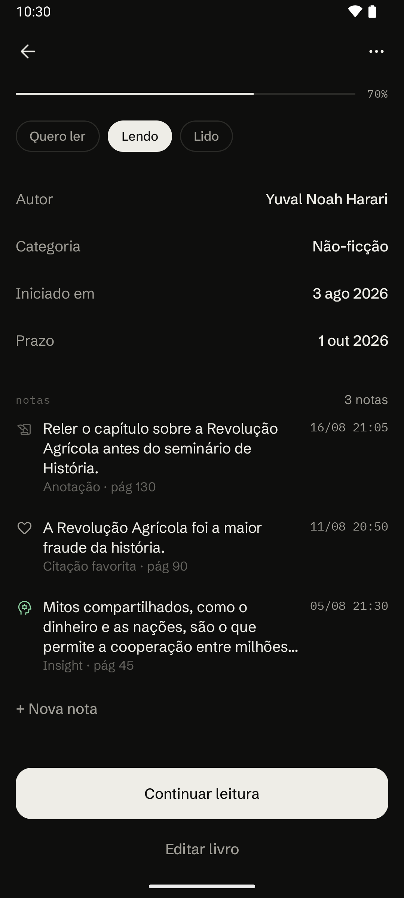<br>Notas do livro</td>
    <td align="center">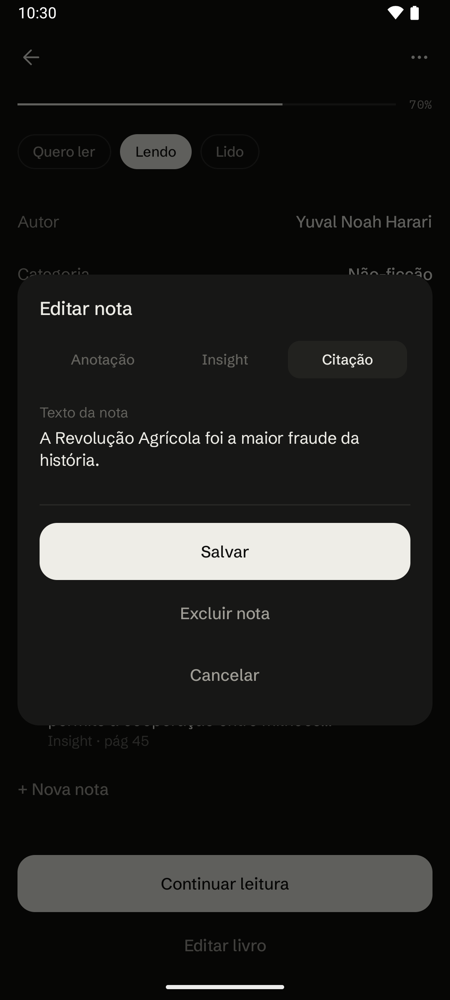<br>Editar nota</td>
  </tr>
</table>

### Sessão ativa

A sessão ativa marca o tempo de leitura com um cronômetro que pode ser pausado. O usuário define páginas como metas da sessão e marca cada uma ao alcançá-la. Ao finalizar, informa a página em que parou, e o app grava a sessão e atualiza o progresso do livro.

<table>
  <tr>
    <td align="center">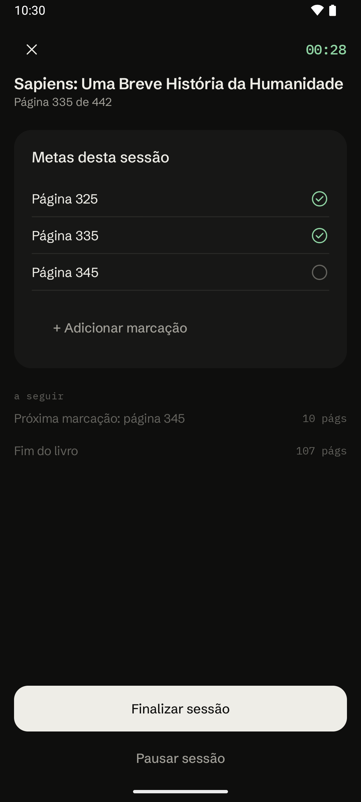<br>Sessão em andamento</td>
    <td align="center">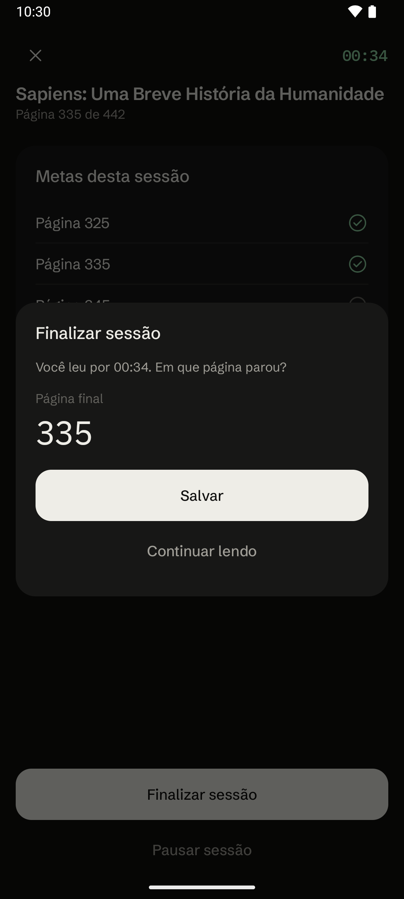<br>Finalizar sessão</td>
  </tr>
</table>

### Desempenho

As abas Semana, Mês e Ano mostram as páginas lidas no período, a comparação com o período anterior e um gráfico de barras. Os cartões trazem livros concluídos, páginas e a sequência de dias com leitura. As conquistas listam os livros terminados, com recordes pessoais e cumprimento do prazo, e os meses em que a meta foi batida.

<table>
  <tr>
    <td align="center">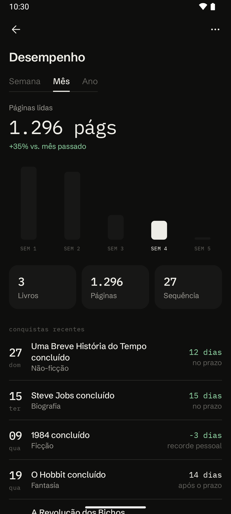<br>Mês</td>
    <td align="center">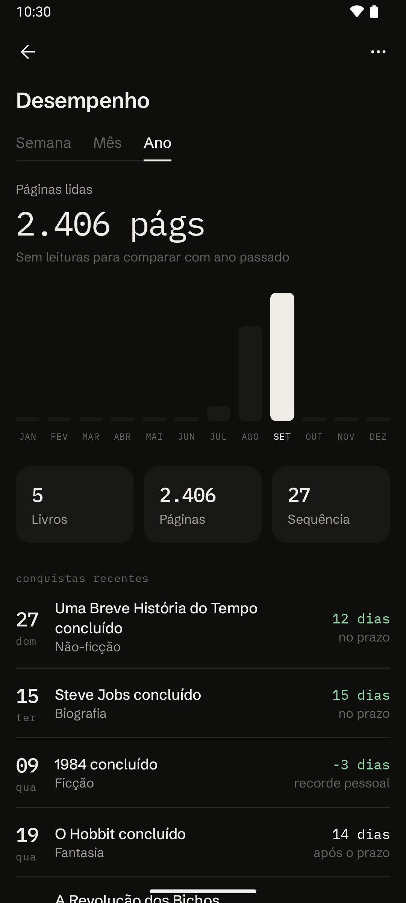<br>Ano</td>
  </tr>
</table>

### Testes

- Unitários: regras de progresso, validações do formulário, sessão ativa e estatísticas de desempenho
- Instrumentados: consultas dos DAOs de livros, notas e sessões

---

## App 02: Meus Treinos

Aplicativo para registrar treinos de musculação e corridas. O usuário monta fichas de treino com vários exercícios, acompanha a evolução das cargas e registra corridas com o cálculo do ritmo médio.

### Arquitetura

- Activities com View Binding e listas com RecyclerView
- MVVM com ViewModels expondo o estado com StateFlow
- Room com as tabelas `rotina`, `exercicio`, `registro_carga` e `corrida`

### Modelo de dados

| Tabela | Campos principais | Relação |
|---|---|---|
| `rotina` | nome, grupo muscular, data de realização | |
| `exercicio` | nome, grupo muscular | |
| `registro_carga` | carga em kg, séries, repetições, data | N para 1 com `rotina` e N para 1 com `exercicio` |
| `corrida` | distância em km, tempo em segundos, data | |

A tabela `registro_carga` liga cada treino aos exercícios feitos nele. Uma rotina tem vários registros (1:N) e um exercício acumula o histórico de cargas de todos os treinos (1:N).

### Fichas de treino

Cadastro de treinos como Leg Day, Pull Day e Push Day, com a associação de vários exercícios. Para cada exercício marcado, o usuário informa carga, séries e repetições. O detalhe mostra o volume total do treino.

<table>
  <tr>
    <td align="center">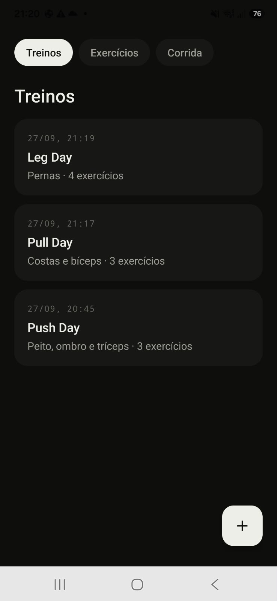<br>Treinos</td>
    <td align="center">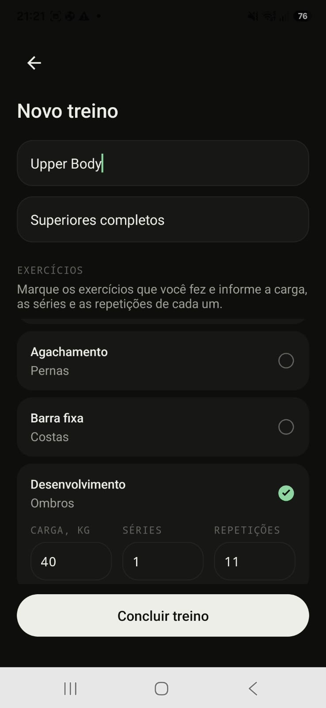<br>Novo treino</td>
    <td align="center">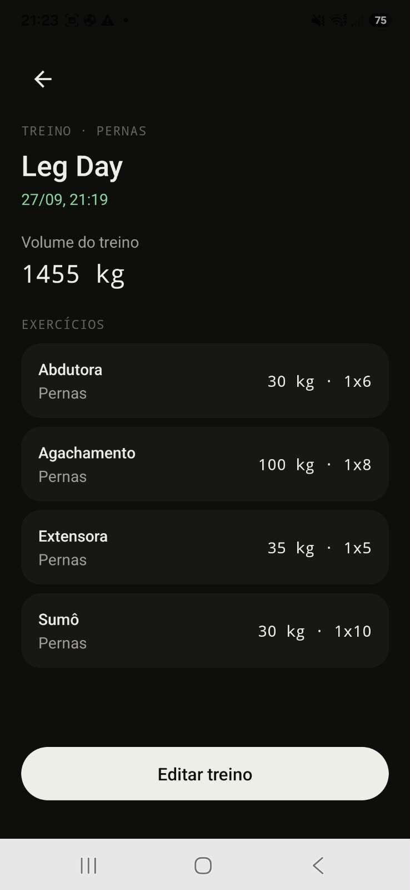<br>Detalhe do treino</td>
  </tr>
</table>

### Exercícios, busca e filtros

Lista de exercícios com campo de busca e filtros por grupamento muscular. Os filtros são montados a partir dos grupos cadastrados.

<table>
  <tr>
    <td align="center">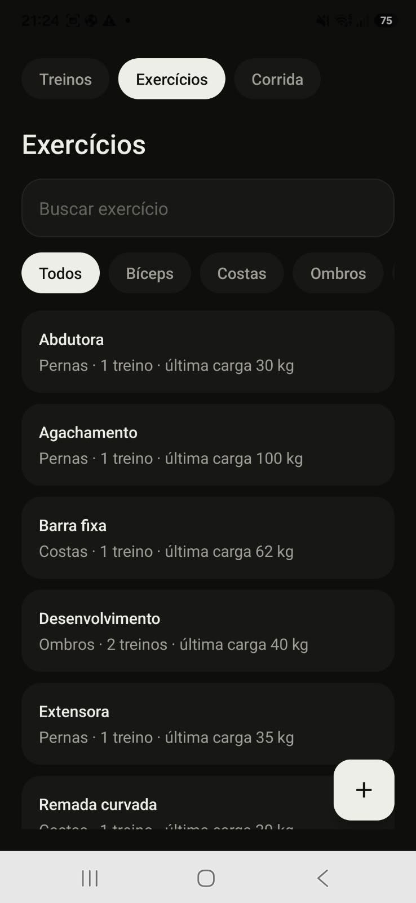<br>Exercícios</td>
    <td align="center">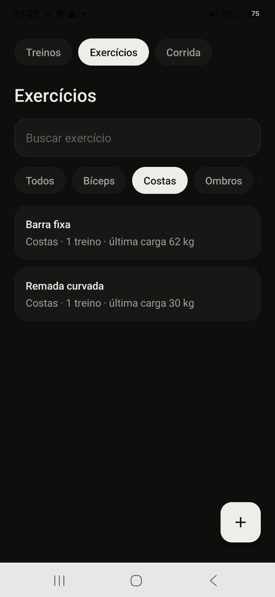<br>Filtro por grupo</td>
  </tr>
</table>

### Histórico de cargas

Cada exercício mostra a última carga, a maior carga e a evolução, com um gráfico de carga por treino e o histórico completo de registros.

<table>
  <tr>
    <td align="center">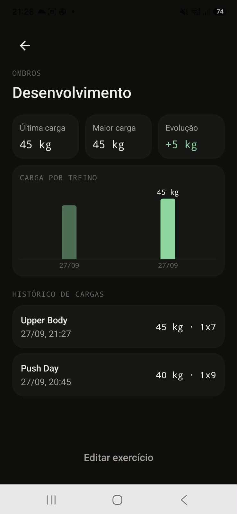<br>Evolução de carga</td>
  </tr>
</table>

### Corrida

Registro de corridas com distância e tempo total. O ritmo médio (pace) é calculado dividindo o tempo pela distância e exibido em minutos por quilômetro.

<table>
  <tr>
    <td align="center">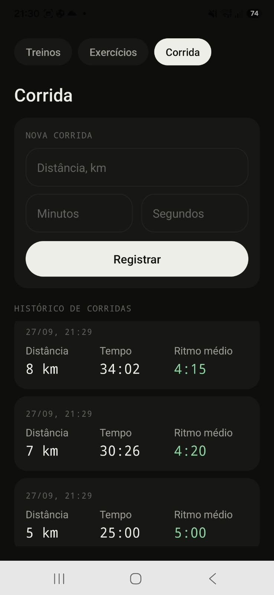<br>Corrida</td>
  </tr>
</table>

---

## App 03: Em Dia

Aplicativo para acompanhar faturas a pagar, valores a receber e prazos de entrega. Os lembretes são agendados em segundo plano e chegam como notificações, mesmo com o app fechado.

### Arquitetura

- Activities com View Binding e listas com RecyclerView
- MVVM com ViewModels expondo o estado com StateFlow
- Room com as tabelas `obligations` e `reminders` (1:N)
- WorkManager para os lembretes e para a verificação diária de atrasos
- NotificationManager com canais próprios e pedido de permissão no Android 13 ou superior
- DatePicker e TimePicker nativos para o vencimento

### Modelo de dados

| Tabela | Campos principais | Relação |
|---|---|---|
| `obligations` | tipo, descrição, favorecido, valor, vencimento, repetição mensal, situação | |
| `reminders` | antecedência, horário do disparo, estado (agendado, disparado ou cancelado) | N para 1 com `obligations` |

### Início e filtros

Resumo do mês com o total a pagar e o percentual concluído. As abas filtram por tipo e a lista é separada em atrasados, hoje, próximos 7 dias, mais adiante e concluídos.

<table>
  <tr>
    <td align="center">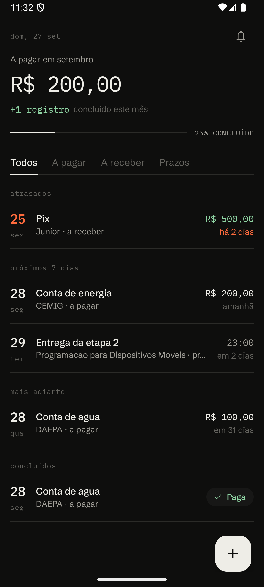<br>Todos</td>
    <td align="center">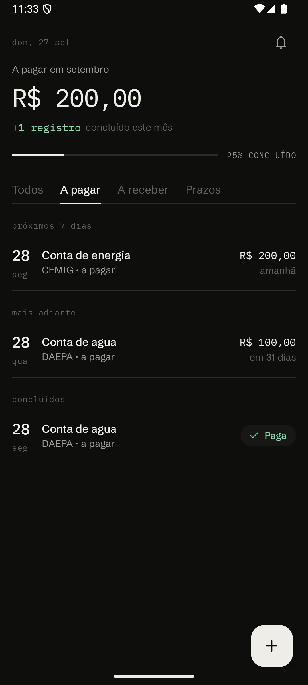<br>A pagar</td>
    <td align="center">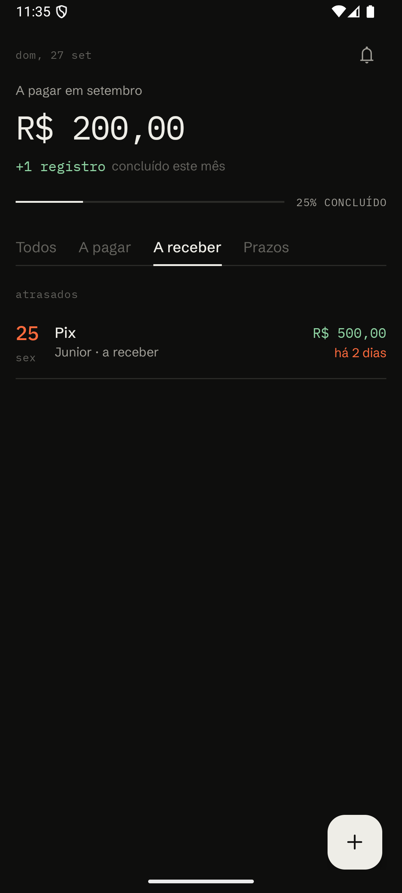<br>A receber</td>
    <td align="center">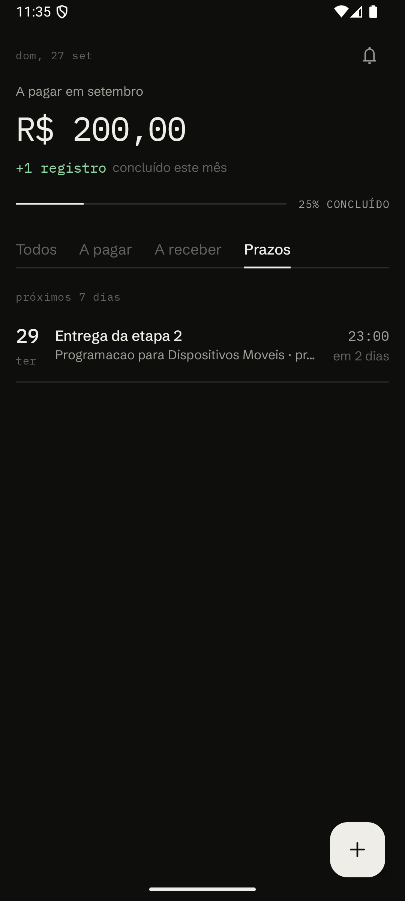<br>Prazos</td>
  </tr>
</table>

### Registro de obrigações

O formulário cadastra faturas a pagar, valores a receber e prazos. Faturas exigem valor e favorecido. O vencimento é escolhido com os seletores nativos de data e hora. As pílulas definem quando lembrar (no dia, 1 dia antes, 3 dias antes ou 1 semana antes) e a opção de repetir todo mês cria a próxima ocorrência ao liquidar.

<table>
  <tr>
    <td align="center"><br>A pagar</td>
    <td align="center">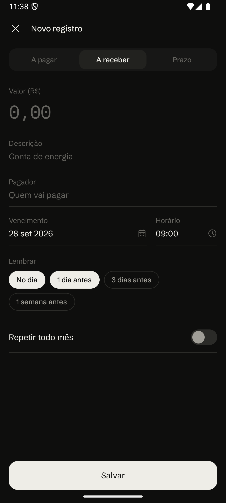<br>A receber</td>
    <td align="center">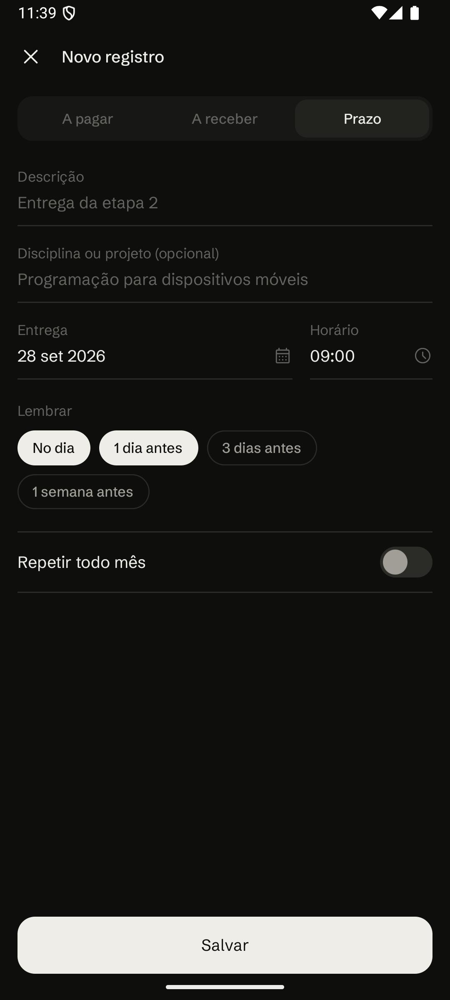<br>Prazo</td>
  </tr>
  <tr>
    <td align="center">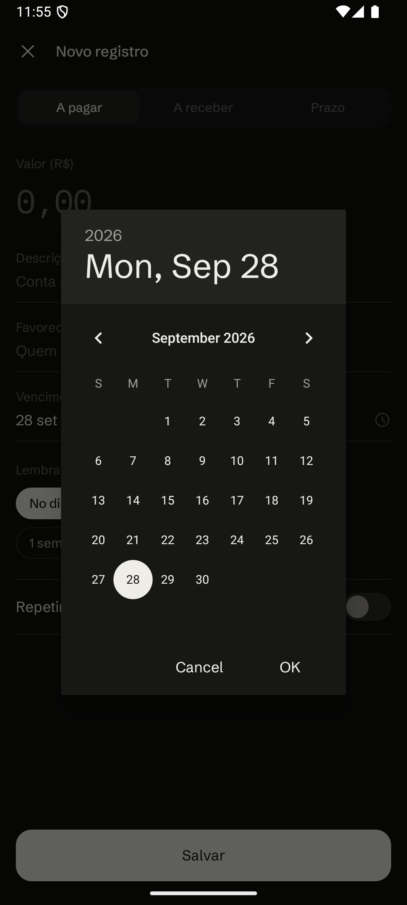<br>DatePicker</td>
    <td align="center">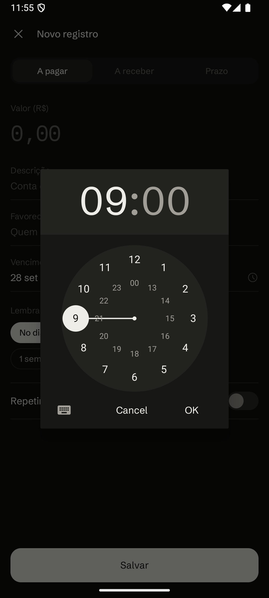<br>TimePicker</td>
    <td></td>
  </tr>
</table>

### Liquidação e status

O detalhe mostra o valor, o vencimento e os lembretes com o estado de cada um. O botão Marcar como paga (ou recebida) liquida a obrigação e cancela os alertas pendentes. Uma obrigação liquidada pode ser reaberta.

<table>
  <tr>
    <td align="center">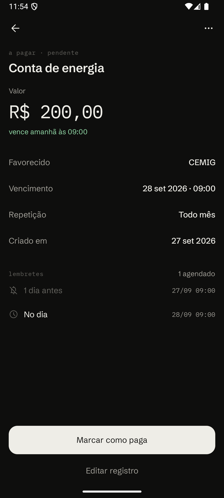<br>Pendente</td>
    <td align="center">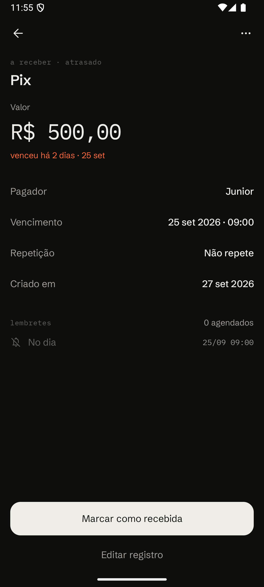<br>Atrasada</td>
    <td align="center">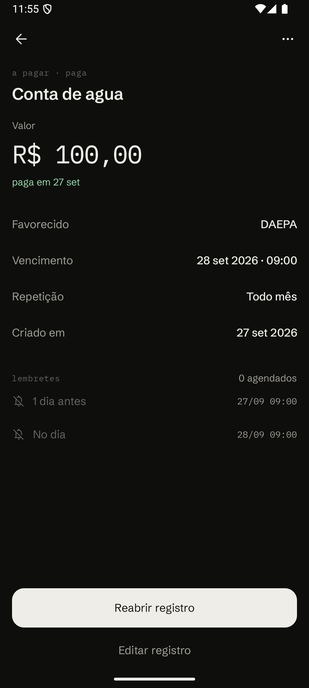<br>Paga</td>
  </tr>
</table>

### Notificações em segundo plano

Cada lembrete vira um trabalho do WorkManager, agendado para o horário escolhido. A notificação traz a ação Marcar como paga, que liquida a obrigação sem abrir o app. Uma verificação diária avisa sobre registros atrasados.

<table>
  <tr>
    <td align="center">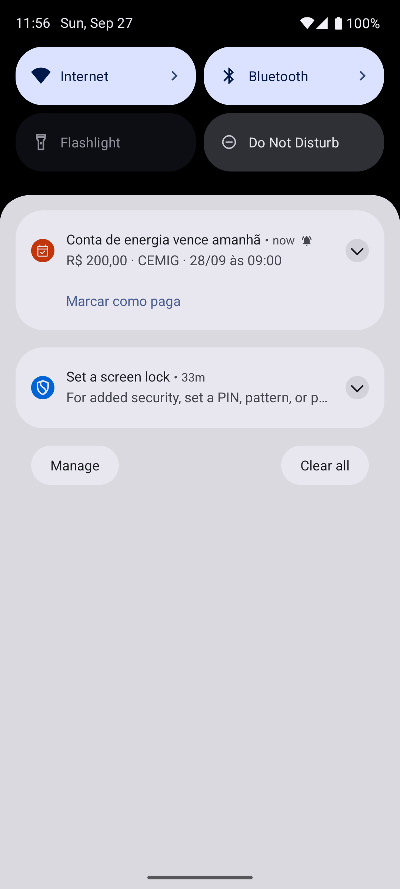<br>Notificação</td>
    <td align="center">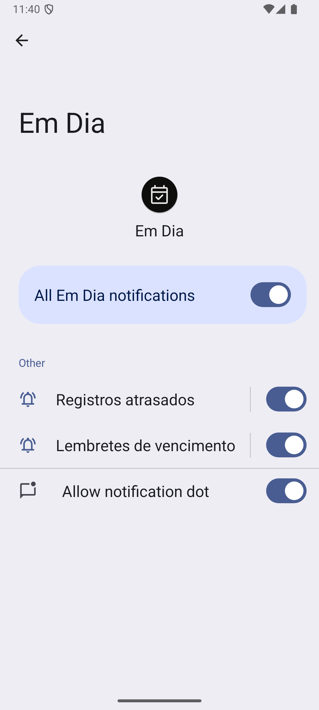<br>Canais de notificação</td>
  </tr>
</table>

### Resumo

Valores pagos por semana, mês e ano em um gráfico de barras, com a contagem de concluídos, pendentes e atrasados.

<table>
  <tr>
    <td align="center">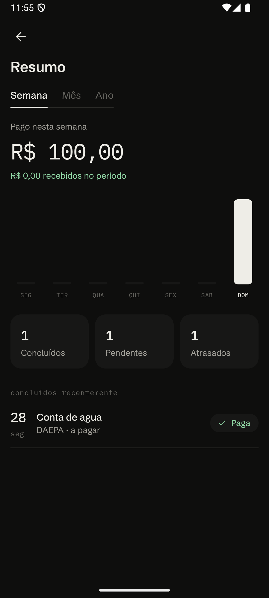<br>Semana</td>
    <td align="center">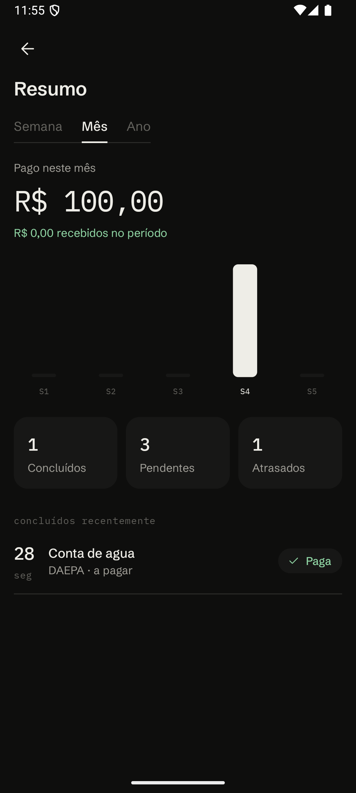<br>Mês</td>
  </tr>
</table>

### Testes

- Unitários: formatação de datas, horários e valores em reais
- Instrumentados: consultas do DAO de obrigações e lembretes

---

## Divisão do trabalho

| App | Augusto | Gustavo |
|---|---|---|
| 01 Ler+ | Estrutura do projeto, design system em Compose, entidade de livros e DAO, repositório e meta mensal, navegação e tela Início | Notas e sessões no banco, Detalhe com progresso e situação, diário de notas, Sessão ativa, Desempenho e formulário de Novo registro |
| 02 Meus Treinos | | Desenvolvimento completo |
| 03 Em Dia | Desenvolvimento completo | |

O histórico de commits de cada pasta mostra a autoria de cada parte.
